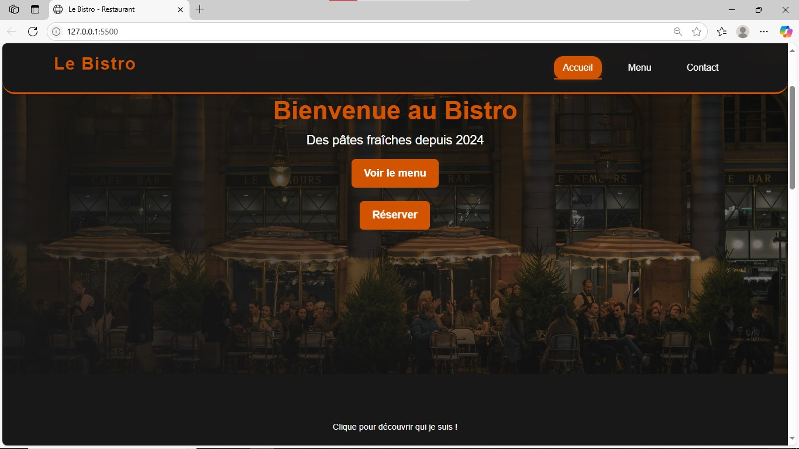

# 🍽️ Le Bistro - Site Vitrine

[](LICENSE)
[](https://dilane17.github.io/le-bistro)
[](https://github.com/Dilane17/le-bistro/stargazers)

**Site vitrine moderne pour restaurant** avec réservation en ligne et menu interactif.

[➡️ Accéder au site](https://dilane17.github.io/le-bistro) | 
[🐛 Signaler un bug](https://github.com/Dilane17/le-bistro/issues)




## ✨ Fonctionnalités
- ✅ **Design responsive** (mobile, tablette, desktop)
- 🎨 **Animations fluides** (CSS/JS)
- 📱 **Formulaire de réservation**
- 🍝 **Menu interactif** avec filtres
- 📍 **Intégration Google Maps**

## 🛠 Technologies


## 🚀 Installation
1. Cloner le dépôt :
```bash
git clone https://github.com/Dilane17/le-bistro.git
